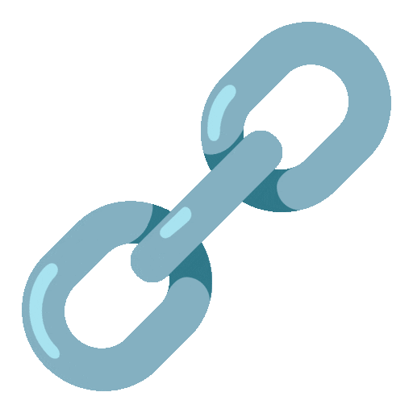

<h1>Hey, great to see you! </h1>

Welcome to my page!  
I'm Diego. I'm a full-stack developer in training, and I'm from <strong>Medellín, Colombia</strong> 🇨🇴. I'm always interested in learning new fields and technologies.

<h3> Tech stack I code with</h3>

    
    
    
    
    
    
    
    

<h3> Current focus</h3>

Right now, I'm looking for a great project to keep improving my programming skills. I'm working on some personal front-end projects and trying to improve my back-end and DevOps skills.

<h3> GitHub Stats</h3>

<table border="1px solid black">
    <thead align="center">
        <tr>
            <td><b> Projects</b></td>
            <td><b> Stars</b></td>
            <td><b> Forks</b></td>
            <td><b> Issues</b></td>
            <td><b> Pull requests</b></td>
        </tr>
    </thead>
    <tbody>
        <tr>
            <td><a href="https://github.com/diegogonzalezloa/React-and-Tailwind-Project"><b>React-and-Tailwind-Project</b></a></td>
            <td></td>
            <td></td>
            <td></td>
            <td></td>
        </tr>
        <tr>
            <td><a href="https://github.com/diegogonzalezloa/my-website"><b>my-website</b></a></td>
            <td></td>
            <td></td>
            <td></td>
            <td></td>
        </tr>
    </tbody>
</table>

<h3> Where you find me</h3>

